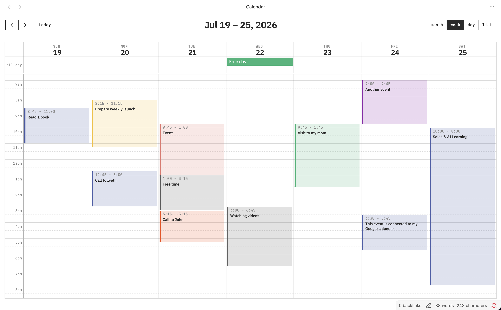

# Full Calendar Plugin

Keep your calendar in your vault! This plugin integrates the [FullCalendar](https://github.com/fullcalendar/fullcalendar) library into your Obsidian Vault so that you can keep your ever-changing daily schedule and special events and plans alongside your tasks and notes, and link freely between all of them. Each event is stored as a separate note with special frontmatter so you can take notes, form connections and add context to any event on your calendar.

## Highlights

- **Clean, focused week view** — your schedule at a glance with month, week, day and list layouts, all-day events, and a distraction-free design that feels native to Obsidian.
- **Color-coded events** — assign a color per event (or inherit the calendar's color) so different areas of your life are easy to tell apart.
- **Markdown event descriptions** — write event descriptions in Obsidian's own live-preview editor: headings, lists, links and formatting render as you type, right inside the event modal.
- **Events as notes** — every event is a note with frontmatter, so you can link, tag, and add context like anywhere else in your vault.
- **Multiple sources** — pull events from note frontmatter or daily-note event lists, sync with Google Calendar, and subscribe to read-only ICS and CalDAV remote calendars.

You can find the full documentation [here](https://obsidian-community.github.io/obsidian-full-calendar/)!

The FullCalendar library is released under the [MIT license](https://github.com/fullcalendar/fullcalendar/blob/master/LICENSE.txt) by [Adam Shaw](https://github.com/arshaw). It's an awesome piece of work, and it would not have been possible to make something like this plugin so easily without it.

## Installation

Full Calendar is available from the Obsidian Community Plugins list -- just search for "Full Calendar" paste this link into your browser: `obsidian://show-plugin?id=obsidian-full-calendar`.

### Manual Installation

You can also head over to the [releases page](https://github.com/obsidian-community/obsidian-full-calendar/releases) and unzip the latest release inside of the `.obsidian/plugins` directory inside your vault.
